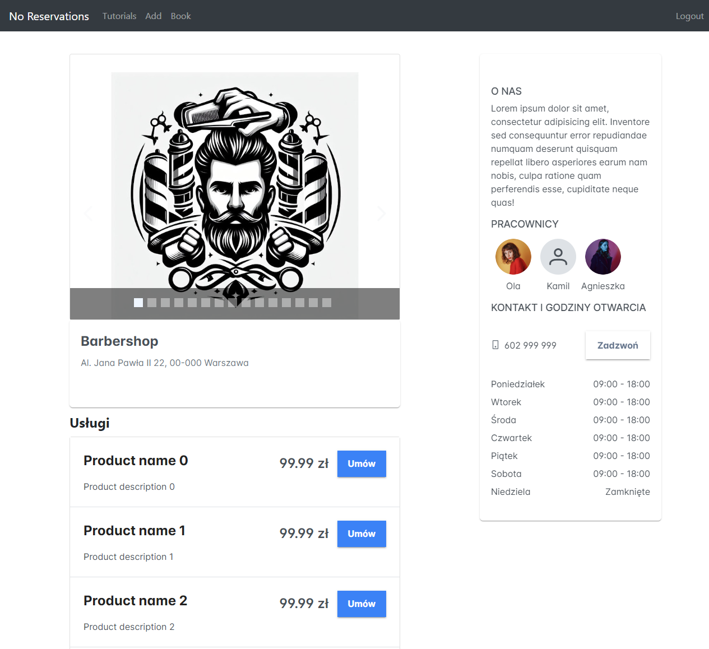

# Spring Boot + Angular 16 + PostgreSQL CRUD Reservations

Full-stack Angular 16 + Spring Boot  CRUD Application with PostgreSQL database in that.




## Run Spring Boot application
```
mvn spring-boot:run
```
The Spring Boot Server will export API at port `8081`.

## Run Angular Client
```
npm install
ng serve --port 8081
```
